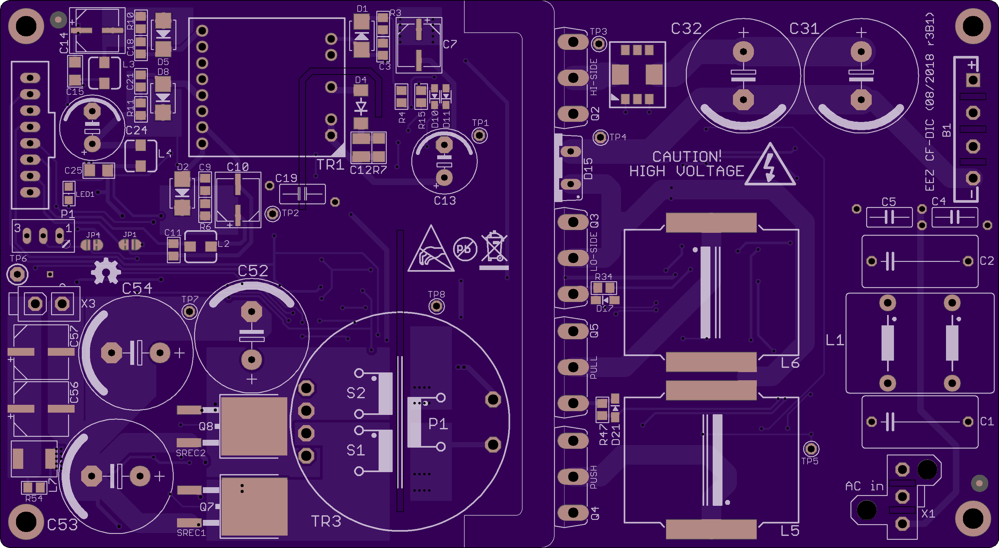

Current-fed dual inductor converter (CF-DIC) project files (work in progress)

### Feature list

* Wide AC input 85-265 Vac
* Wide DC output: 3-52 V controlled by tracker circuit
* Cascaded PWM Controller LM5041B (sync buck + push-pull stage)
* Isolated HV power ground and signal ground for improved noise immunity
* High performance SiC MOSFET switches
* High performance Vitroperm 500 F core material for power transformer
* Max. current 5 A continuously (i.e. max. power is 260 W)
* Synchronous rectifier with low R(gs,on) MOSFET switches
* Over-current protection (OCP)
* Output over-voltage protection (OVP)
* f(sw,buck)= ~68 kHz, f(sw,pp)= ~34 kHz
* QR flyback as bias power supply (VIPer35)
* Compact size (155 x 85 mm)

### PCB layout preview

*Top layer*

*Bottom layer*