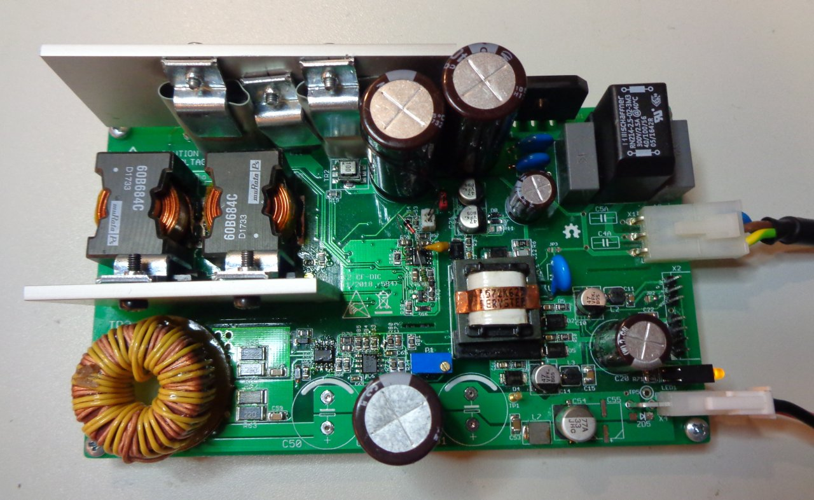
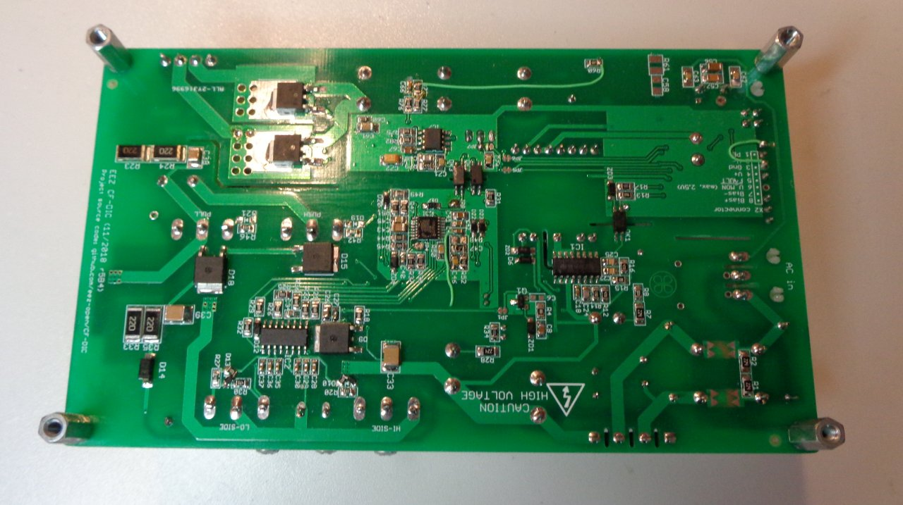

Current-fed dual inductor converter (CF-DIC) project files

Inspired by article Filho, Barbi (1996), *[A comparison between two current-fed push-pull DC-DC converters-analysis, design and experimentation](https://www.researchgate.net/publication/3673781_A_comparison_between_two_current-fed_push-pull_DC-DC_converters-analysis_design_and_experimentation)* and made with great assistance of Dragoljub Aleksijević (aka *Macola*).

### Feature list

* Wide AC input 85 - 265 V
* Wide DC output: 2.5 - 53 V
* Output voltage controlled by tracker circuit or optionally with multiturn trimpot
* Cascaded PWM Controller LM5041B (sync buck + push-pull stage)
* Isolated HV power ground and signal ground for improved noise immunity
* High performance SiC MOSFET switches
* High performance Vitroperm 500F core material for power transformer
* Max. current 5 A continuously (i.e. max. power is 260 W)
* Synchronous rectifier with low R(gs,on) MOSFET switches
* Over-voltage (OVP), short circuit protection and over-temperature protection (OTP) with latch and "Fault" output
* Bias power supply outputs: +6 V, -8 V and "floating" +20 V
* Over-current protection (OCP)
* f(sw,buck)= ~68 kHz, f(sw,pp)= ~34 kHz
* QR flyback as bias power supply (VIPer35)
* Compact size (155 x 90 mm)

### r5B4 prototype

